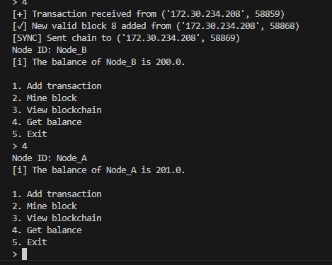

# Relatório — Resolução de Fork

Aluno: Leonardo Pacheco

Testei localmente com Docker (2 containers: `blockchain_node_a` e `blockchain_node_b`) e tbm em outro computador, após conseguir acesso de uma empresa.

---

## 1) Causa do erro

O problema é um fork: dois nós produziram blocos válidos com o mesmo índice quase ao mesmo tempo. Em redes P2P descentralizadas isso é esperado sempre que há latência ou mineração concorrente. Nome técnico da pesquisa: "bloqueio concorrente" ou "blockchain fork".

Por que acontece aqui:

- Cada nó valida e aceita blocos localmente antes de sincronizar com peers.
- Quando dois blocos válidos (mesmo prev_hash e mesmo índice) são gerados quase simultaneamente, cada nó passa a ter uma cadeia diferente.

---

## 2) Métodos comuns para resolver forks

- Longest chain rule (vencedora = cadeia mais longa) — simples, comum em blockchains educacionais.
- Proof-of-Work cumulative difficulty — usado aqui; soma o trabalho total, não só comprimento.
- GHOST / heaviest-subtree — alternativa que usa topologia da árvore.
- Finalidade probabilística — aguardar N confirmações antes de confiar na transação.

---

## 3) Solução escolhida e detalhes

Escolhi dificuldade cumulativa (simples de implementar).

- `consensus.py`: nova lógica para calcular dificuldade cumulativa e comparar cadeias. Funções principais: - `calculate_cumulative_difficulty(chain)` — soma 2^leading_zeros por bloco; - `compare_chains(a,b)` — retorna qual cadeia tem mais trabalho; - `should_reorganize(current, candidate)` — decide se a reorganização é necessária.

- `network.py`: ao receber bloco que não encaixa (possível fork), o nó aciona `sync_with_peers()` que pede a cadeia do peer e usa `should_reorganize()` para decidir se adota a cadeia do peer.

- `chain.py`: integra chamadas de broadcast e sincronização;
- `mine_block()` continua gerando coinbase automaticamente.

---

## 4) Resultados novos

Após aplicar/usar a implementação por dificuldade cumulativa, os testes demonstram:

- Forks ainda podem ocorrer, mas são resolvidos automaticamente quando os nós sincronizam.
- Exemplo:

```
[FORK] Potential fork detected from ('172.18.0.3', 36572)
[SYNC] Sent chain to ('172.18.0.3', 36586)
[REORG] Reorganizing chain from peer blockchain_node_X
[REORG] Old chain length: 7, New chain length: 8
```

- Teste real, outra maquina:
  

---

## 5) Arquitetura (sistema e software)

- Diagrama de sistema: dois nós (containers/hosts) conectados por rede P2P, portas TCP expostas.
- Diagrama de software: módulos `main.py` (CLI + servidor), `chain.py` (blockchain), `network.py` (comunicação), `consensus.py` (decisão).

```
┌─────────────────────────────────────────────────────────┐
│              Rede Blockchain P2P                         │
│                                                          │
│  ┌──────────────┐      Camada de Rede       ┌──────────┐ │
│  │   Nó A       │◄────────────────────────► │  Nó B    │ │
│  │ (Port 5001)  │   TCP Socket / JSON       │Port 5002 │ │
│  │              │                           │          │ │
│  │ ┌──────────┐ │                           │┌────────┐│ │
│  │ │Blockchain│ │   Tipos de Mensagem:      ││Blockcha││ │
│  │ │  Store   │ │   - block                 ││in Store││ │
│  │ │  (JSON)  │ │   - tx                    ││ (JSON) ││ │
│  │ └──────────┘ │   - get_chain             │└────────┘│ │
│  │              │   - chain response        │          │ │
│  │ ┌──────────┐ │                           │┌────────┐│ │
│  │ │  Mining  │ │                           ││ Mining ││ │
│  │ │  Engine  │ │                           ││ Engine ││ │
│  │ │   PoW    │ │                           ││  PoW   ││ │
│  │ └──────────┘ │                           │└────────┘│ │
│  │              │                           │          │ │
│  │ ┌──────────┐ │                           │┌────────┐│ │
│  │ │Consensus │ │◄─────────────────────────►││Consensu││ │
│  │ │  Module  │ │   Sync & Reorg            ││s Module││ │
│  │ │          │ │                           ││        ││ │
│  │ └──────────┘ │                           │└────────┘│ │
│  └──────────────┘                           └──────────┘ │
│                                                          │
│  Opções:                                                 │
│  ├─ Usando zerotier | docker (containers)                │
└──────────────────────────────────────────────────────────┘
```

---

## 6) Links

- Repositório (público): https://github.com/ThreeOneOneZero/blockchain_example

Fiz o trabalho em Docker para facilitar testes sem precisar de dupla física — cada container representa um nó.
Também testei em outro computador, com uma rede separada.

executar `docker-compose up`; `attach nos dois nós`;
executar `python main.py configs/node_a_config.json 2>&1` | `node_b` respectivamente, configurar IP no arquivo peers_a.json e peers_b.json.

pasta db - `histórico de mineração correspondente`

---

Transações sendo recebidas ao fazer alguma mineração:




Internet do outro computador caiu, recebi informando que deu time out.

